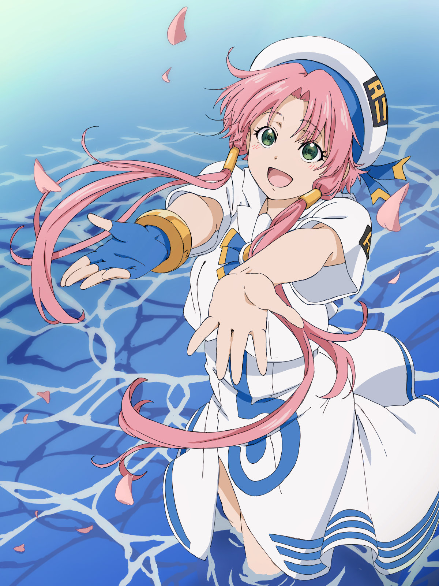

水无灯里，个人 Acgn 中的最爱之一。

一个每天都带着微笑的女孩，性格天真烂漫，好奇心满满，对任何人都热情友善，因此大家都会对她开阔心胸，遇到美好的事情时会讲让人害羞的话。练习划舟时不时会思绪飞散导致被蓝华吐槽。

口头禅是

    > 诶诶诶!

    > 啊哇哇哇!! 
          
    > 太不可思议了!!!
    
称号是

      遥阔湛蓝
   
      Aquamarine
   
      遙かなる蒼
  
      海蓝宝石

孤身一人来到[水星]——(AQUA)，成为 Aria Company 的领航员，在水都——新威尼斯(Neo-Venezia)中，讲述了灯里与亚利亚社长以及好友每天练习凤尾舟和冒险的故事，平淡而又令人感动。

    
    

